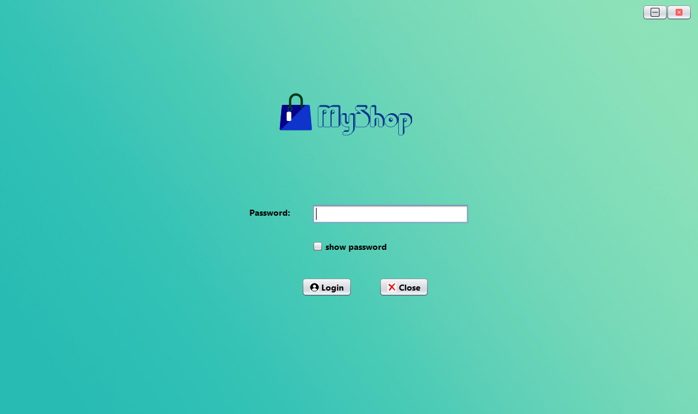
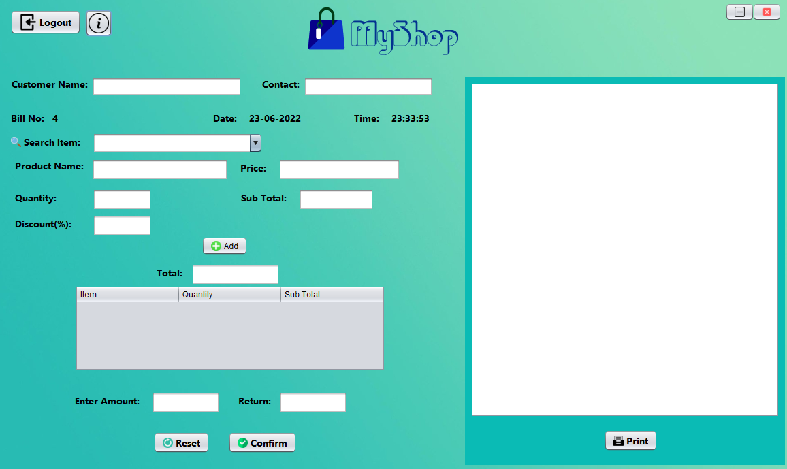
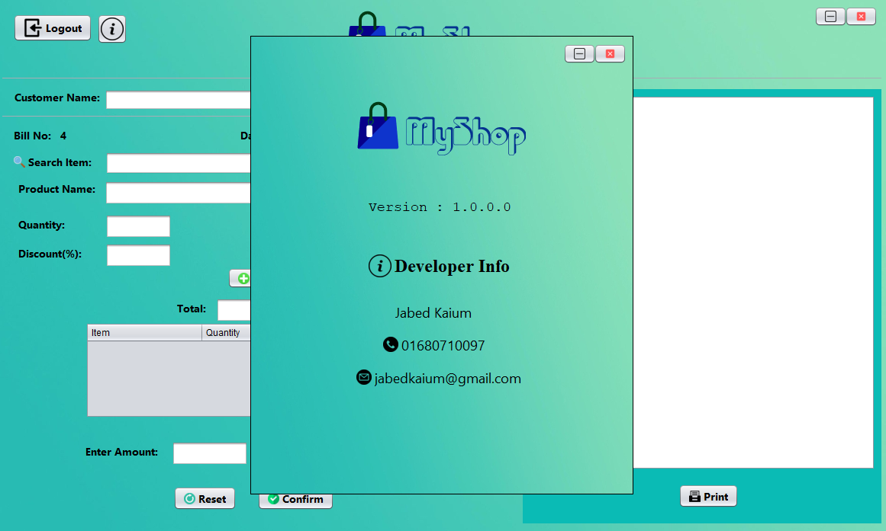

# MyShop-User

Technology used: Java Swing, MySQL

It is the user side software for the project MyShop which is a supermarket billing and product management software.
Users are generally the salespersons.

#### Functionalities

<ul>
    <li>User can search for product.</li>
    <li>Add the product to list.</li>
    <li>Generate a bill receipt.</li>
</ul>

#### Sample pictures

